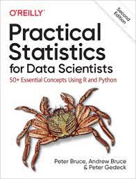

# Practical Statistics for Data Scientists (O'Reilly)
### Code Reproduction & Theoretical Deep-Dive for Machine Learning & Deep Learning

[](https://colab.research.google.com/)
[](https://opensource.org/licenses/MIT)
[](https://www.python.org/downloads/)

<p align="center">
  
</p>

This repository contains the complete code reproduction, theoretical explanations, mathematical deep-dives, and chapter-by-chapter summaries for **Chapters 1 through 4** based on the reference textbook **"Practical Statistics for Data Scientists: 50+ Essential Concepts Using R and Python"** (2nd Edition) by Peter Bruce, Andrew Bruce, and Peter Gedeck (O'Reilly Media).

---

## 📚 Table of Contents

- [Overview](#-overview)
- [Repository Structure](#-repository-structure)
- [Chapter Summaries](#-chapter-summaries)
  - [Chapter 1: Exploratory Data Analysis](#chapter-1-exploratory-data-analysis)
  - [Chapter 2: Data and Sampling Distributions](#chapter-2-data-and-sampling-distributions)
  - [Chapter 3: Statistical Experiments and Significance Testing](#chapter-3-statistical-experiments-and-significance-testing)
  - [Chapter 4: Regression and Prediction](#chapter-4-regression-and-prediction)
- [Datasets](#-datasets)
- [Installation and Environment Setup](#-installation-and-environment-setup)
- [References & Links](#-references--links)

---

## 📖 Overview

The objective of this project is to bridge core statistical principles with practical machine learning implementation. Statistical concepts are foundational to data exploration, hypothesis formulation, feature engineering, and model validation. 

Each notebook reproduces the book's examples using Python scientific libraries (`pandas`, `numpy`, `scipy`, `statsmodels`, `seaborn`, `matplotlib`, `wquantiles`, `scikit-learn`) accompanied by rigorous theoretical explanations, mathematical formulations, and practical data science takeaways.

---

## 📂 Repository Structure

```plaintext
.
├── PracticalStatisticsChapter1.ipynb   # Chapter 1: Exploratory Data Analysis
├── PracticalStatisticsChapter2.ipynb   # Chapter 2: Data and Sampling Distributions
├── PracticalStatisticsChapter3.ipynb   # Chapter 3: Statistical Experiments and Significance Testing
├── PracticalStatisticsChapter4.ipynb   # Chapter 4: Regression and Prediction
├── requirements.txt                    # Python library dependencies
├── _config.yml                         # Jekyll configuration for GitHub Pages
├── cover.jpeg                          # Book cover image
├── README.md                           # Main repository documentation & chapter summaries
├── data/                               # Directory containing all reference datasets
│   ├── state.csv                       # US state demographic and murder rate data
│   ├── dfw_airline.csv                 # DFW airport flight delay statistics
│   ├── sp500_sectors.csv               # S&P 500 stock sectors classification
│   ├── sp500_data.csv.gz               # S&P 500 historical price time-series
│   ├── kc_tax.csv.gz                   # King County tax assessment dataset
│   ├── lc_loans.csv                    # Lending Club loan status data
│   ├── airline_stats.csv               # Airline delay carrier statistics
│   ├── loans_income.csv                # Borrowers annual income data
│   ├── web_page_data.csv               # Web page session time test data
│   ├── four_sessions.csv               # Four-page web session stickiness data
│   ├── click_rates.csv                 # Headline click-through rate test data
│   ├── imanishi_data.csv               # Imanishi experimental session data
│   ├── LungDisease.csv                 # PEFR vs. exposure years data
│   └── house_sales.csv                 # King County house sales data
```

---

## 📝 Chapter Summaries

### Chapter 1: Exploratory Data Analysis
**Notebook:** [`PracticalStatisticsChapter1.ipynb`](./PracticalStatisticsChapter1.ipynb)

Exploratory Data Analysis (EDA), pioneered by John W. Tukey, emphasizes that data investigation, pattern visualization, and metric summarization must precede any modeling attempt.

- **Data Taxonomies**: Distinguishes numeric variables (continuous, discrete) and categorical variables (nominal, ordinal, binary) to guide proper metric and visualization choices.
- **Estimates of Location**:
  - *Mean vs. Median*: Arithmetic mean is sensitive to extreme values. Robust measures like the **trimmed mean** (omitting the top/bottom $p$ observations) and **median** provide reliable location metrics in skewed or contaminated distributions.
  - *Weighted Mean & Weighted Median*: Account for varying reliability or unequal representation across observations:
    $$\bar{x}_{\text{weighted}} = \frac{\sum_{i=1}^n w_i x_i}{\sum_{i=1}^n w_i}$$
- **Estimates of Variability**:
  - *Standard Deviation & Variance*: Measure dispersion around the mean, but squared terms amplify outlier sensitivity.
  - *Median Absolute Deviation (MAD)* & *Interquartile Range (IQR)*: Robust dispersion metrics resilient against heavy tails:
    $$\text{MAD} = \text{Median}(|x_1 - m|, |x_2 - m|, \dots, |x_n - m|)$$
- **Exploring Distributions**:
  - *Boxplots*: Summarize median, 25th/75th percentiles (IQR), and outliers ($> 1.5 \times \text{IQR}$).
  - *Histograms & Density Estimates (KDE)*: Provide continuous approximations of probability density functions (PDF), exposing multi-modality and skewness.
- **Binary and Categorical Data**: Mode, Expected Values, Bar Charts, and Contingency Tables.
- **Multivariate Analysis**:
  - Scatterplots for bivariate patterns.
  - *Hexagonal Binning & 2D Contour Plots*: Overcome overplotting in large datasets ($n > 10^4$).
  - *Violin Plots & FacetGrids*: Combine kernel density estimation with boxplots across multiple categorical subsets.

---

### Chapter 2: Data and Sampling Distributions
**Notebook:** [`PracticalStatisticsChapter2.ipynb`](./PracticalStatisticsChapter2.ipynb)

Contrasts underlying population distributions with the sampling distribution of an estimator, providing the foundation for statistical inference.

- **Random Sampling and Selection Bias**:
  - Quality exceeds quantity: large sample sizes cannot compensate for systematic bias.
  - *Selection Bias & Data Snooping*: Searching through numerous model combinations without validation produces spurious patterns.
- **Sampling Distribution & Central Limit Theorem (CLT)**:
  - Regardless of whether the population distribution is skewed, uniform, or multi-modal, the sampling distribution of the sample mean converges toward a normal distribution as sample size $n$ increases ($n \ge 30$).
  - *Standard Error (SE)*: Quantifies sampling variability, shrinking inversely with $\sqrt{n}$:
    $$\text{SE} = \frac{s}{\sqrt{n}}$$
- **The Bootstrap**:
  - Non-parametric resampling algorithm drawing repeated samples *with replacement* from the observed dataset to empirically approximate sampling distributions and confidence intervals without parametric assumptions.
- **Confidence Intervals**:
  - Represents frequentist coverage probability: a $95\%$ confidence interval implies that $95\%$ of such constructed intervals across repeated samplings contain the true population parameter.
- **Parametric Distributions**:
  - *Normal Distribution*: Standard bell curve characterized by $\mu$ and $\sigma$; assessed via Quantile-Quantile (Q-Q) plots.
  - *Student's t-Distribution*: Possesses heavier tails than the normal curve, parameterized by degrees of freedom ($df$) for small-sample inferences.
  - *Binomial Distribution*: Probability of observing $k$ successes in $n$ independent Bernoulli trials with parameter $p$:
    $$P(Y = k) = \binom{n}{k} p^k (1 - p)^{n - k}$$
  - *Poisson & Exponential Distributions*: Model counts of rare independent events per interval (Poisson, parameter $\lambda$) and elapsed time between events (Exponential, mean $1/\lambda$).
  - *Weibull Distribution*: Models survival analysis and system reliability with shape ($k$) and scale ($\lambda$) parameters.

---

### Chapter 3: Statistical Experiments and Significance Testing
**Notebook:** [`PracticalStatisticsChapter3.ipynb`](./PracticalStatisticsChapter3.ipynb)

Focuses on experimental design to prove causality and distinguish true effects from random noise.

- **A/B Testing & Controlled Experiments**:
  - Compares Treatment vs. Control groups under randomized allocation to establish causal impact.
  - Distinguishes practical business significance from statistical significance.
- **Hypothesis Testing**:
  - Formulates Null Hypothesis ($H_0$: no difference) and Alternative Hypothesis ($H_a$: true effect exists).
- **Resampling & Permutation Tests**:
  - Combines observations from both groups, shuffles without replacement, and randomly re-divides into artificial groups to simulate the empirical distribution under $H_0$.
  - Free from normality or variance-homogeneity assumptions.
- **Statistical Significance, p-Values, and Errors**:
  - *p-Value*: The probability of observing an effect as extreme as (or more extreme than) the test result, assuming $H_0$ is true.
  - *Type I Error ($\alpha$)*: Rejecting $H_0$ when it is actually true (false positive).
  - *Type II Error ($\beta$)*: Failing to reject $H_0$ when a true effect exists (false negative).
  - *Multiple Testing*: When evaluating multiple variants or metrics, false discoveries compound; corrections (e.g., Bonferroni, FDR) are mandatory.
- **Parametric Tests**:
  - *t-Test*: Compares two independent sample means.
  - *ANOVA (Analysis of Variance)*: Compares means across three or more groups simultaneously using the F-statistic (between-group variance divided by within-group variance).
  - *Chi-Square ($\chi^2$) Test*: Tests independence and goodness-of-fit in categorical contingency tables.
- **Multi-Arm Bandits (MAB)**:
  - Reinforcement learning framework balancing *exploration* (learning option payoffs) and *exploitation* (allocating traffic to current best performers), maximizing cumulative reward over static A/B testing.
- **Power and Sample Size**:
  - Pre-experiment power analysis ($1 - \beta$, commonly $80\%$) based on expected effect size (Cohen's $d$) ensures experiments are sufficiently powered to detect meaningful differences.

---

### Chapter 4: Regression and Prediction
**Notebook:** [`PracticalStatisticsChapter4.ipynb`](./PracticalStatisticsChapter4.ipynb)

Establishes the foundation of predictive modeling, evaluating relationships between one or more predictors and a continuous outcome.

- **Simple & Multiple Linear Regression**:
  - Ordinary Least Squares (OLS) estimates parameters by minimizing the Sum of Squared Errors (SSE):
    $$\hat{Y} = \beta_0 + \beta_1 X_1 + \beta_2 X_2 + \dots + \beta_p X_p$$
  - *Prediction vs. Explanation*: Prediction optimizes for generalization on unseen data; explanatory modeling focuses on unbiased coefficient interpretation and inference under *ceteris paribus* (holding other variables constant).
- **Model Evaluation**:
  - *RMSE & MAE*: Quantify prediction error in native target units.
  - *Coefficient of Determination ($R^2$)*: Proportion of total response variance explained by predictors.
  - *Adjusted $R^2$*: Incorporates a penalty for additional features to prevent misleading increases in $R^2$.
- **Model Selection & Stepwise Regression**:
  - Enforces parsimony (Occam's razor). Uses **AIC** (Akaike Information Criterion) and **BIC** (Bayesian Information Criterion) to select optimal feature subsets via forward selection, backward elimination, or stepwise search.
- **Weighted Regression**:
  - Addresses heteroskedasticity by weighting observations inversely proportional to error variance.
- **Factor Variables & Encoding**:
  - Converts categorical features with $k$ levels into $k - 1$ dummy indicators, preventing the linear dependency known as the "dummy variable trap".
- **Regression Diagnostics**:
  - *Residual Analysis*: Evaluates homoskedasticity, linearity, and error normality.
  - *Outliers vs. Influential Points*: Measures leverage and **Cook's Distance** to identify observations that disproportionately shift model parameters.
  - *Multicollinearity*: Assessed using Variance Inflation Factor (VIF).
- **Non-Linear Extensions**:
  - *Polynomial Regression*: Captures curvature via higher-order terms.
  - *Spline Regression & GAMs*: Fits piecewise polynomials smoothly joined at knots to prevent global polynomial oscillations, generalized by Generalized Additive Models.

---

## 📊 Datasets

All datasets referenced across the four notebooks are stored locally in the [`data/`](./data/) directory and duplicated at the project root for seamless out-of-the-box notebook execution:

| Dataset | File | Description | Primary Chapter |
| :--- | :--- | :--- | :--- |
| **US State Stats** | `state.csv` | Population, murder rates, and state metrics | Chapter 1 |
| **DFW Flight Delays** | `dfw_airline.csv` | Categorical flight delay counts at DFW airport | Chapter 1 |
| **S&P 500 Sectors** | `sp500_sectors.csv` | Sector classification for S&P 500 equities | Chapter 1 |
| **S&P 500 Prices** | `sp500_data.csv.gz` | Historical stock price time-series | Chapter 1, 2 |
| **King County Tax** | `kc_tax.csv.gz` | Assessed property values and living square footage | Chapter 1 |
| **LendingClub Loans** | `lc_loans.csv` | Borrower grades, loan status, and recovery rates | Chapter 1 |
| **Airline Stats** | `airline_stats.csv` | Carrier-specific delay percentages | Chapter 1 |
| **Loans Income** | `loans_income.csv` | Sampling distributions of borrower annual income | Chapter 2 |
| **Web Page Data** | `web_page_data.csv` | Page session times for A/B testing | Chapter 3 |
| **Four Sessions** | `four_sessions.csv` | Session stickiness across 4 page versions (ANOVA) | Chapter 3 |
| **Click Rates** | `click_rates.csv` | Headline click-through test counts (Chi-Square) | Chapter 3 |
| **Imanishi Data** | `imanishi_data.csv` | Experimental digit test data | Chapter 3 |
| **Lung Disease** | `LungDisease.csv` | Peak expiratory flow rate vs. exposure years | Chapter 4 |
| **House Sales** | `house_sales.csv` | King County real estate transaction features | Chapter 4 |

---

## 🛠️ Installation and Environment Setup

### 1. Clone the Repository
```bash
git clone https://github.com/<your-username>/Practical-Statistics-for-Data-Scientists.git
cd Practical-Statistics-for-Data-Scientists
```

### 2. Set Up Virtual Environment (Recommended)
```bash
python -m venv venv
# On Windows:
venv\Scripts\activate
# On Linux/macOS:
source venv/bin/activate
```

### 3. Install Dependencies
```bash
pip install --upgrade pip
pip install -r requirements.txt
```

### 4. Launch Jupyter Notebook or JupyterLab
```bash
jupyter notebook
```

---

## 🔗 References & Links

1. **Primary Reference Book**:  
   Bruce, P., Bruce, A., & Gedeck, P. (2020). *Practical Statistics for Data Scientists: 50+ Essential Concepts Using R and Python* (2nd ed.). O'Reilly Media.  
   - [Book Resource on Google Drive](https://drive.google.com/file/d/1dR9228_PRCN5_Hjs9ClxYgKe5zmifkmb/view?usp=sharing)
2. **Official Book Repository**:  
   [gedeck/practical-statistics-for-data-scientists](https://github.com/gedeck/practical-statistics-for-data-scientists)
3. **Reference Submission**:  
   [farrelrassya/Practical-Statistics-for-Data-Scientist-Books](https://github.com/farrelrassya/Practical-Statistics-for-Data-Scientist-Books)

---

## ⚖️ Academic Integrity & Notes

This repository was created as an individual submission for **TUGAS 1 (Enrichment for Machine Learning and Deep Learning Classes)**. All code reproductions and theoretical deep-dives adhere to academic integrity standards. Explanations and syntheses have been curated to provide comprehensive educational value.
